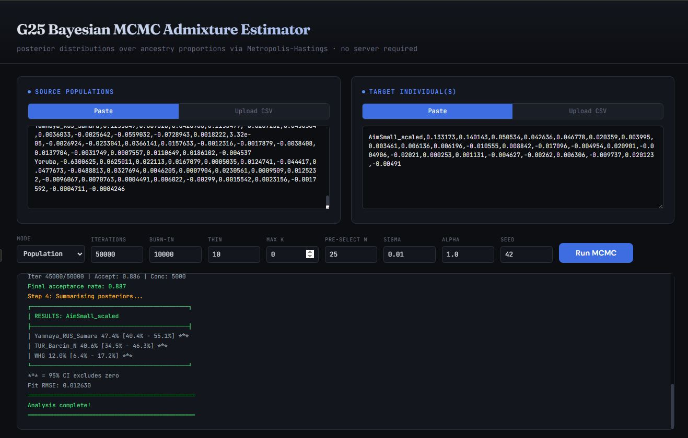
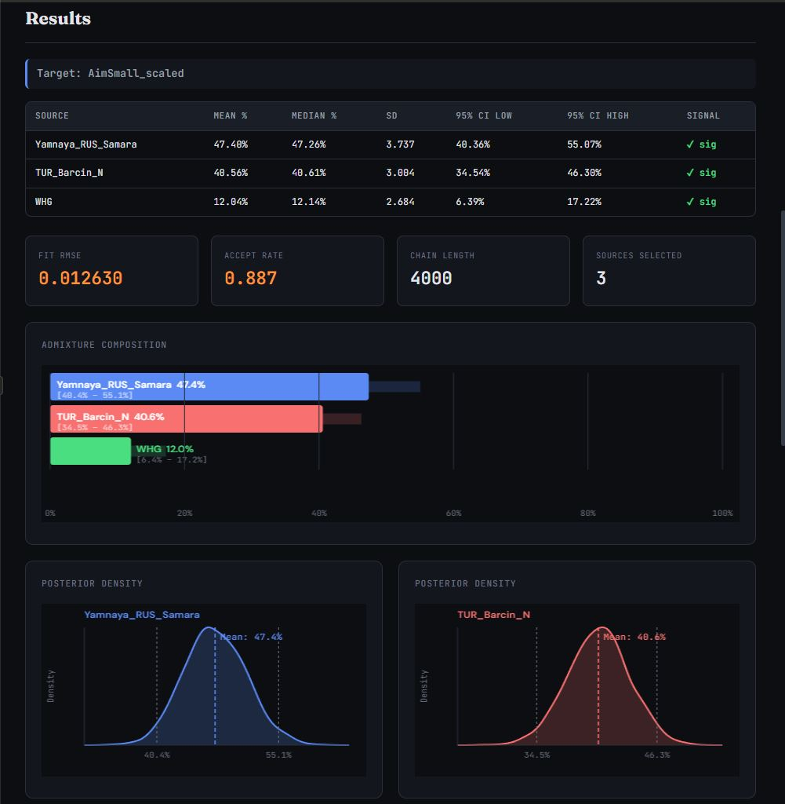
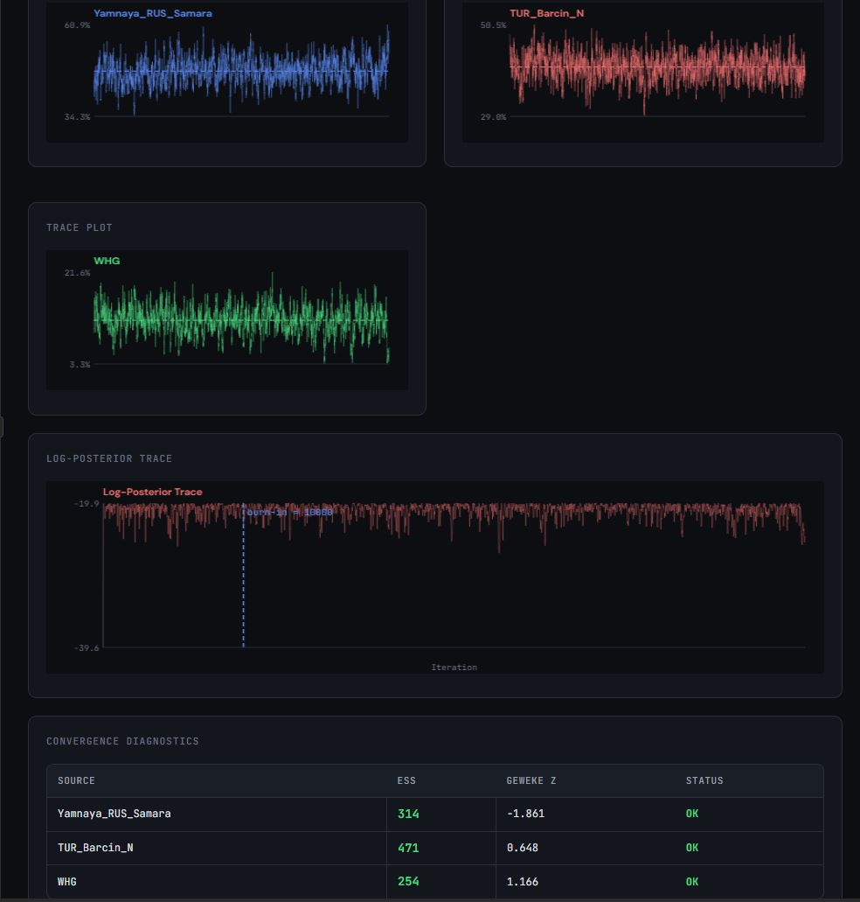
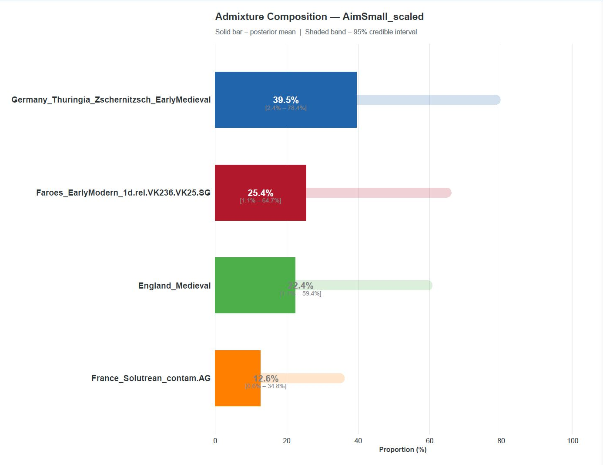
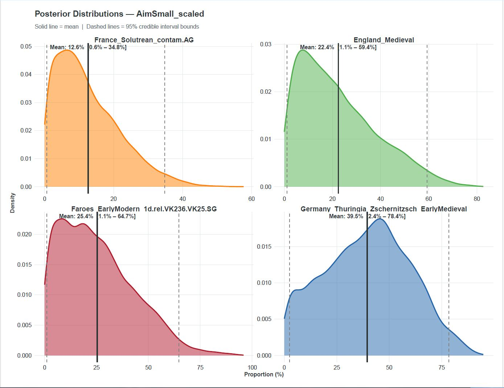
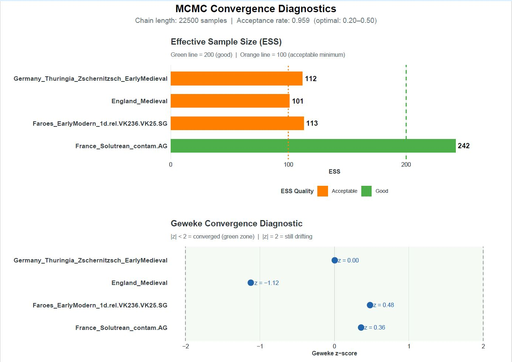

# G25 Bayesian MCMC Admixture Estimator

A Bayesian approach to ancestry decomposition from Global25 (G25) PCA coordinates, using Markov Chain Monte Carlo sampling to produce full posterior distributions over admixture proportions — not just point estimates.

**Now available in two versions:**

- **R Script** — command-line tool for batch processing, scripting, and integration into research pipelines
- **Web App** — browser-based interface with interactive charts, no installation required

Both versions implement the same statistical engine: multi-strategy pre-selection, forward stepwise BIC model selection, and Metropolis-Hastings MCMC with Dirichlet priors. They produce equivalent results — choose based on your workflow.

## The Problem with Current Tools

Tools like [Vahaduo](https://vahaduo.github.io/vahaduo/) are the standard front-end for working with G25 coordinates. They are fast, accessible, and have done an enormous amount to democratize population genetics for non-specialists. But under the hood, Vahaduo and similar calculators use **constrained least-squares optimization**: they find the weighted combination of source populations that minimizes the Euclidean distance to your target in 25-dimensional PCA space.

This approach has a fundamental limitation: **it gives you a single answer with no measure of confidence**.

When Vahaduo reports that you are "38% Yamnaya, 35% Anatolian Farmer, 22% Western Hunter-Gatherer, 5% CHG," every one of those numbers looks equally certain. But they aren't. The 38% Yamnaya might be rock-solid — the model cannot explain your coordinates without substantial Steppe ancestry. The 5% CHG, on the other hand, might be pure fitting noise — an artifact of the optimizer distributing residual error across available sources. Least-squares gives you no way to distinguish these two situations.

This is not a minor cosmetic issue. It leads to real misinterpretation. People compare results across runs, across calculators, across individuals, treating 2–3% differences as meaningful when they may be well within the noise floor of the method. Forum debates about whether someone has "real" Component X at 4% versus someone else at 6% are often debates about nothing.

## What This Tool Does Differently

This tool replaces the least-squares point estimate with **Bayesian inference via MCMC**, which treats each source population's contribution as a probability distribution rather than a fixed number.

The entire project was inspired by watching this video [The Algorithm That Made Modern AI Possible by StringsandTheory](https://www.youtube.com/watch?v=LDiklt4dV24).  After watching I wondered whether the techniques could be applied to admixture analysis.

### The Statistical Model

The target individual's G25 coordinates are modeled as a weighted sum of source population coordinates plus Gaussian noise:

```
target ≈ Σ_k  w_k · source_k  +  ε,      ε ~ N(0, σ²I)
```

The weights are given a **Dirichlet prior**, which naturally enforces the constraints that all proportions must be non-negative and sum to 1:

```
w ~ Dirichlet(α, α, ..., α)
```

The **Metropolis-Hastings algorithm** then explores the space of all possible weight combinations, sampling proportionally to the posterior probability. After discarding an initial burn-in period, the collected samples form an empirical approximation of the full posterior distribution over admixture proportions.

### What You Get

Instead of a single number per source, you get:

| Source | Mean | Median | 95% Credible Interval | Significant? |
|---|---|---|---|---|
| Yamnaya | 37.8% | 38.1% | [32.4% – 43.0%] | ✓ |
| Anatolian_EF | 34.6% | 34.5% | [29.1% – 40.3%] | ✓ |
| WHG | 22.1% | 22.0% | [17.8% – 26.9%] | ✓ |
| CHG | 5.5% | 4.9% | [0.0% – 12.8%] | ✗ |

*(Example output — not from real data)*

Now the 5.5% CHG component is immediately identifiable as uncertain: its credible interval includes zero, meaning the model can explain your coordinates perfectly well without it. The Yamnaya and WHG components, by contrast, have tight intervals that exclude zero — those are real signals.

## Why Bayesian MCMC Is an Improvement

### 1. Uncertainty Quantification

The most important advantage. Least-squares tells you *what*; Bayesian inference tells you *how sure*. A 95% credible interval of [32% – 43%] means something fundamentally different from [5% – 60%], but both would appear as a single number in Vahaduo.

### 2. Honest Treatment of Model Degeneracy

G25 has 25 dimensions, but many ancient populations cluster together in PCA space. Yamnaya and Corded Ware, for example, overlap substantially. When you ask a least-squares solver to split the difference between them, it makes an arbitrary choice. The Bayesian approach instead shows you the degeneracy directly: the posteriors for highly correlated sources will be wide, anti-correlated, and overlapping — a clear signal that the data cannot distinguish between them at the resolution available.

### 3. Principled Source Selection

The tool uses a multi-stage approach to decide which and how many source populations to include:

**Pre-selection** casts a wide net using four independent strategies run in parallel: a properly converged non-negative least-squares solver (coordinate descent, not the toy gradient descent used in naive implementations), greedy residual-chasing that iteratively finds sources explaining remaining residuals, Euclidean nearest-neighbor distance, and directional cosine similarity. Any source flagged by any method is kept as a candidate. This avoids the failure mode where a source is individually distant from the target but essential for the mixture — the classic example being Western Hunter-Gatherers in a modern European model.

**Forward stepwise selection** then builds up from K=1, at each step trying every remaining candidate and adding whichever one most improves the Bayesian Information Criterion (BIC). This balances fit quality against model complexity, naturally penalizing the inclusion of sources that don't meaningfully improve the reconstruction. The process stops when BIC increases for three consecutive additions.

### 4. Regularization via the Prior

The Dirichlet prior concentration parameter (`--alpha`) acts as a built-in regularizer. At `α = 1.0` (default), the prior is uniform — all possible weight combinations are equally likely *a priori*. Setting `α < 1.0` (e.g., 0.5) favors sparse solutions where most weights are near zero, naturally suppressing the small noise contributions that plague unconstrained least-squares. This is conceptually similar to LASSO regularization but arises naturally within the Bayesian framework rather than being bolted on as an ad hoc penalty.

### 5. Convergence Diagnostics

Both versions include built-in diagnostics so you can verify that the MCMC chain has actually converged and the results are trustworthy:

- **Effective Sample Size (ESS)**: How many independent samples the chain is actually providing after accounting for autocorrelation. Low ESS means the chain needs to run longer.
- **Geweke diagnostic**: A z-test comparing the mean of the first 10% of the chain to the last 50%. Values with |z| > 2 suggest the chain hasn't reached stationarity.
- **Trace plots**: Visual inspection of the chain's behavior over time. A well-mixed chain looks like white noise; a poorly-mixed chain shows trends, drift, or sticky patches.

---

## Choosing a Version

Both versions produce equivalent statistical results. The difference is in workflow and output format.

| Aspect | R Script | Web App |
|---|---|---|
| Installation | Requires R | None — open HTML in any browser |
| Interface | Command-line | Point-and-click with paste/upload |
| Input | CSV files on disk | Paste data or upload CSV |
| Output | CSV files + multi-page PDF | Inline tables and interactive charts |
| Batch processing | Yes (scripting, multiple targets) | One run at a time |
| Automation | Integrates into pipelines | Manual |
| Offline use | Yes | Yes (single HTML file, no server) |
| Best for | Researchers, batch runs, reproducible pipelines | Quick exploration, sharing results, no-install usage |

### Visual Comparison

The two versions present the same underlying data in different formats. Below are example outputs from each version using the same input data.

#### Web App

The web interface accepts pasted or uploaded G25 data and exposes all parameters as form controls. Results render inline with interactive charts.

**Input and run log:**



**Results — summary table, diagnostics cards, admixture bar chart, and posterior densities:**



**Results — trace plots, log-posterior trace, and convergence diagnostics table:**



#### R Script (PDF Output)

The R script outputs a multi-page PDF with publication-style plots.

**Admixture composition (bar chart with credible intervals):**



**Posterior distributions:**



**Convergence diagnostics (ESS bar chart and Geweke z-score plot):**



---

## R Script Version

### Installation

No installation required beyond base R. The script has **zero external package dependencies** — it runs on any system with R installed, including older R versions (tested on R 4.3).

```bash
# That's it. Just make sure R is available:
which Rscript
```

### Usage

#### Input Format

Standard G25 CSV format, compatible with Vahaduo and other G25 tools. No header row. The first column contains `Population:SampleName` labels (colon-delimited), followed by 25 numeric columns of PCA coordinates.

```
Yamnaya_Samara:I0357__BC_3021__Cov_66.29%,0.132,0.175,...
Yamnaya_Samara:I0429__BC_2888__Cov_43.01%,0.129,0.171,...
Anatolia_EF:I0736__BC_6419__Cov_52.11%,0.054,0.021,...
WHG:Loschbour__BC_6100__Cov_99.10%,0.081,-0.063,...
```

You need two files: a **source file** containing the reference populations, and a **target file** containing the individual(s) you want to model.

#### Basic Usage

```bash
Rscript g25_bayesian_mcmc.R \
  --source references.csv \
  --target myself.csv \
  --mode population \
  --out my_results
```

#### Full Options

```
Required:
  --source   CSV of source/reference G25 coordinates
  --target   CSV of target individual(s) G25 coordinates

Options:
  --mode     'population' (average per pop) or 'sample'    [default: population]
  --out      Output file prefix                            [default: results]
  --iter     Total MCMC iterations                         [default: 50000]
  --burnin   Burn-in iterations to discard                 [default: 10000]
  --thin     Thinning interval                             [default: 10]
  --max_k    Max source components (0 = auto via BIC)      [default: 0]
  --n_keep   Pre-selection candidates to keep              [default: 25]
  --sigma    Noise std dev in likelihood                   [default: 0.01]
  --alpha    Dirichlet prior concentration                 [default: 1.0]
  --seed     Random seed                                   [default: 42]
```

#### Population vs. Sample Mode

Like Vahaduo's aggregation toggle:

- `--mode population` averages all samples within each population before fitting. Use this when your references contain many samples per population and you want to model against population centroids.
- `--mode sample` treats each sample as an independent source. Use this when you want finer granularity or when populations contain only one sample each.

#### Output Files

For each target individual, the script produces:

| File | Contents |
|---|---|
| `<out>_summary.csv` | Point estimates (mean, median) + 95% credible intervals for each source |
| `<out>_posterior.csv` | Full posterior samples (post burn-in and thinning) for downstream analysis |
| `<out>_diagnostics.txt` | ESS and Geweke convergence diagnostics |
| `<out>_plots.pdf` | Posterior density plots, forest plot with CIs, trace plots |

If multiple targets are provided, each gets its own set of output files (`_target1_`, `_target2_`, etc.) plus a combined summary CSV.

---

## Web App Version

### Getting Started

1. Open `g25_bayesian_mcmc.html` in any modern browser (Chrome, Firefox, Safari, Edge).
2. Paste your G25 source data into the left panel (or upload a CSV file).
3. Paste your target data into the right panel (or upload a CSV file).
4. Adjust parameters if desired (defaults match the R script).
5. Click **Run MCMC**.

The input format is identical to the R script — standard G25 CSV with `Population:SampleName` in the first column followed by 25 coordinate values. Both comma-separated and tab-separated formats are supported.

### What You See

Results render inline below the run log:

- **Summary table** with mean, median, SD, 95% credible intervals, and significance flags for each source
- **Diagnostics cards** showing fit RMSE, acceptance rate, chain length, and number of sources selected
- **Admixture composition bar chart** with solid bars for posterior means and faded bars for 95% credible intervals
- **Posterior density plots** with kernel density estimation, mean lines, and CI boundaries
- **Component trace plots** for visual convergence assessment
- **Log-posterior trace** with burn-in boundary marker
- **Convergence diagnostics table** with ESS and Geweke z-scores

### Technical Notes

The web version runs entirely client-side — no data is sent to any server. The entire MCMC engine, NNLS solver, pre-selection pipeline, and visualization code are contained in a single HTML file. This means:

- **Privacy**: Your genetic data never leaves your browser.
- **Offline use**: Save the HTML file locally and it works without an internet connection (fonts will fall back to system defaults).
- **Performance**: For large iteration counts (100k+), the browser's main thread may block briefly during MCMC sampling. For very heavy runs, the R script version is recommended.

### Parameters

All parameters from the R script are exposed as form controls in the web interface. Hover labels match the command-line flag names. Defaults are identical between versions.

---

## Tuning Guide

These recommendations apply to both versions.

### Sigma (σ) — Likelihood Noise

This controls how tightly the model demands the weighted combination match your target coordinates.

- `0.01` (default): Good general-purpose setting. Tolerates the level of noise typical in G25 coordinates from well-covered ancient samples.
- `0.005`: Tighter fit. Use for high-coverage modern samples where you trust the coordinates are precise.
- `0.02–0.03`: Looser fit. Use for low-coverage ancient samples where coordinates may be noisy, or when you want broader credible intervals that better reflect true uncertainty.

### Alpha (α) — Dirichlet Concentration

Controls the prior preference for sparse vs. distributed solutions.

- `1.0` (default): Uniform prior. All possible weight combinations are equally likely *a priori*. Lets the data speak entirely for itself.
- `0.5`: Mildly sparse. Encourages the model to push small, uncertain components toward zero. Good when you suspect overfitting.
- `0.1`: Strongly sparse. Aggressively favors solutions with few dominant components. Use with caution — can suppress real minor ancestry.
- `2.0+`: Anti-sparse. Favors solutions where weight is distributed more evenly. Rarely useful for admixture modeling.

### n_keep — Pre-Selection Pool Size

How many candidate sources survive the pre-selection filter before forward stepwise selection.

- `25` (default): Good for reference sets up to ~5,000 populations.
- `40–50`: Recommended for very large reference sets (10,000+ populations) or when you want to be extra cautious about missing relevant sources.
- The forward stepwise selection will prune the extras, so erring on the high side costs computation time but not accuracy.

### Iteration Count

- `50,000` (default): Usually sufficient for well-separated sources with K ≤ 8.
- `100,000–200,000`: Recommended if diagnostics show low ESS or failed Geweke tests.
- Check the diagnostics — if ESS < 200 for any active component, increase iterations.

## Limitations and Caveats

**PCA is lossy.** G25 coordinates are a 25-dimensional compression of hundreds of thousands of SNPs. No statistical method operating on PCA-reduced data can recover information lost during dimensionality reduction. Formal methods like qpAdm that work on f-statistics computed from full genotype data are more rigorous for published research — but also far less accessible.

**This is not a replacement for formal admixture analysis.** It is a more statistically principled replacement for the least-squares fitting that tools like Vahaduo perform on PCA coordinates. The underlying data (G25 coordinates) and the fundamental modeling assumption (target = weighted sum of sources) are the same.

**Computational cost scales with reference set size.** The pre-selection step involves solving NNLS against all sources, which takes a few minutes for ~5,000 populations and scales roughly linearly. The MCMC step itself is fast since it operates on the reduced candidate set. In the web version, very large reference sets may cause the browser to lag during pre-selection.

**The model assumes the "true" sources are in your reference set.** If your actual ancestry includes a population not represented in the references, the model will approximate it as a mixture of whatever is available — just like Vahaduo does. The credible intervals will be wider in this case, which is at least more honest than a confident wrong answer.

## How It Compares to Vahaduo

| Aspect | Vahaduo | This Tool |
|---|---|---|
| Method | Constrained least-squares | Bayesian MCMC (Metropolis-Hastings) |
| Output | Single point estimate per source | Full posterior distribution + credible intervals |
| Uncertainty | None reported | 95% credible intervals + significance flags |
| Source selection | User-specified | Automatic via multi-strategy pre-selection + forward stepwise BIC |
| Regularization | None | Dirichlet prior (adjustable sparsity) |
| Convergence verification | N/A | ESS, Geweke diagnostic, trace plots |
| Speed | Instant | Minutes (depending on iterations and reference set size) |
| Dependencies | Web browser | Base R (script) or web browser (web app) |
| Ease of use | Very easy (GUI) | GUI (web) or command-line (R) |

## Relationship to Other Methods

**ADMIXTURE** (Alexander et al., 2009) uses a similar probabilistic framework but operates on raw genotype data, not PCA coordinates. It estimates both the ancestral allele frequencies and the admixture proportions simultaneously using an EM algorithm. This tool is closer in scope to what Vahaduo does — operating on pre-computed PCA coordinates — but with a more principled statistical framework.

**qpAdm** (Haak et al., 2015) tests specific admixture models using f-statistics and is considered the gold standard for formal admixture testing in population genetics. It operates on entirely different mathematical foundations (f4 statistics rather than PCA distances) and provides p-values for model fit. This tool is not a substitute for qpAdm.

**ChromoPainter/fineSTRUCTURE** (Lawson et al., 2012) uses chromosome painting and MCMC to infer fine-scale population structure from haplotype data. It is far more data-intensive and methodologically distinct from PCA-based approaches.

This tool occupies a specific niche: bringing Bayesian uncertainty quantification to the PCA-coordinate-based admixture fitting that the ancient DNA hobbyist community already uses daily.

## Repository Structure

```
├── g25_bayesian_mcmc.R          # R script (command-line version)
├── g25_bayesian_mcmc.html       # Web app (browser version, single file)
├── README.md
├── screenshots/
│   ├── G25_Bayesian_input.JPG   # Web app: input interface
│   ├── G25_Bayesian_results.JPG # Web app: results (table, charts, densities)
│   ├── G25_Bayesian_results2.JPG# Web app: results (traces, diagnostics)
│   ├── k8_comp.JPG              # R script: admixture composition PDF
│   ├── k8_posterior.JPG         # R script: posterior distributions PDF
│   └── k8_conv.JPG              # R script: convergence diagnostics PDF
```

## License

This project is licensed under the GNU General Public License v3.0 - see the [LICENSE](LICENSE) file for details.

## Contributing

Issues and pull requests are welcome. Particular areas where contributions would be valuable:

- Performance optimization for very large reference sets (10,000+ populations)
- Web Worker threading for the web version to prevent UI blocking during long MCMC runs
- Multiple independent chains with Gelman-Rubin (R-hat) convergence diagnostics
- Hierarchical priors that encode known phylogenetic relationships between source populations
- Variational inference as a fast approximate alternative to full MCMC
- Export functionality in the web version (CSV download of posterior samples)
