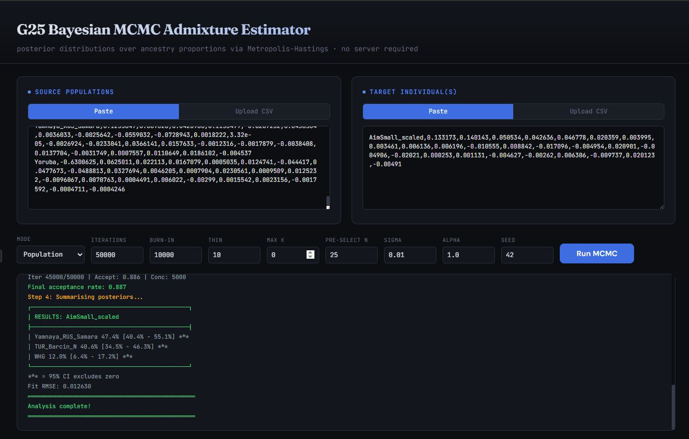
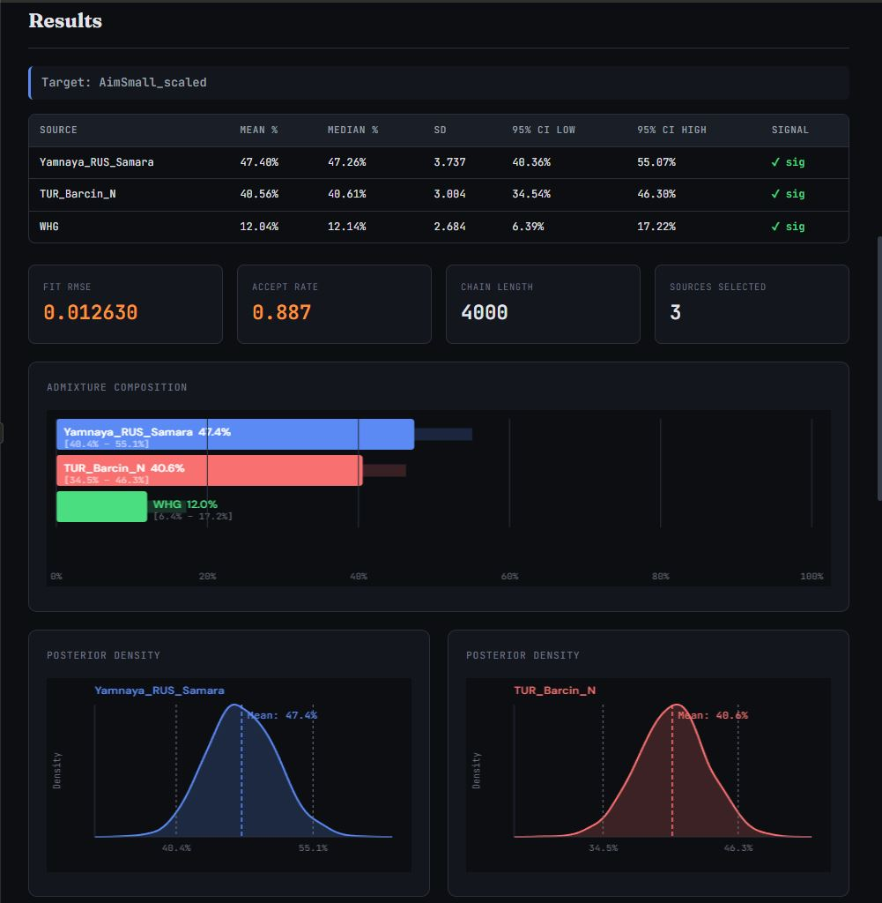
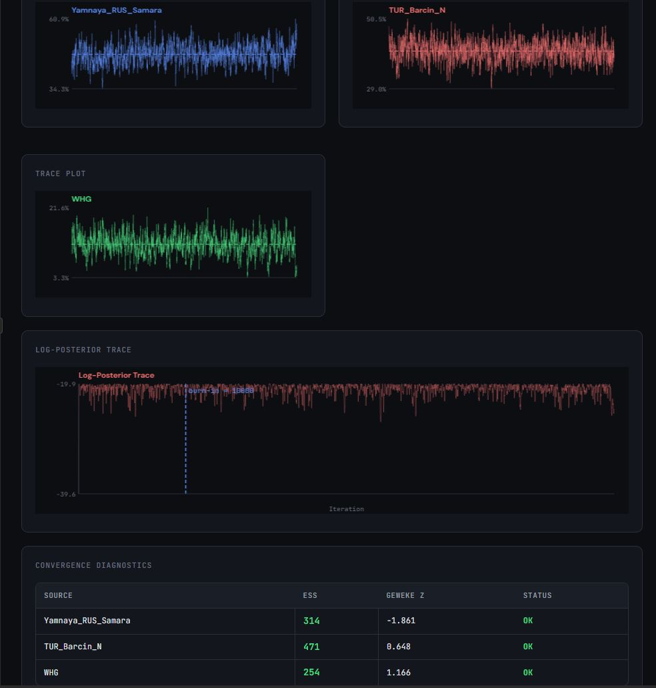
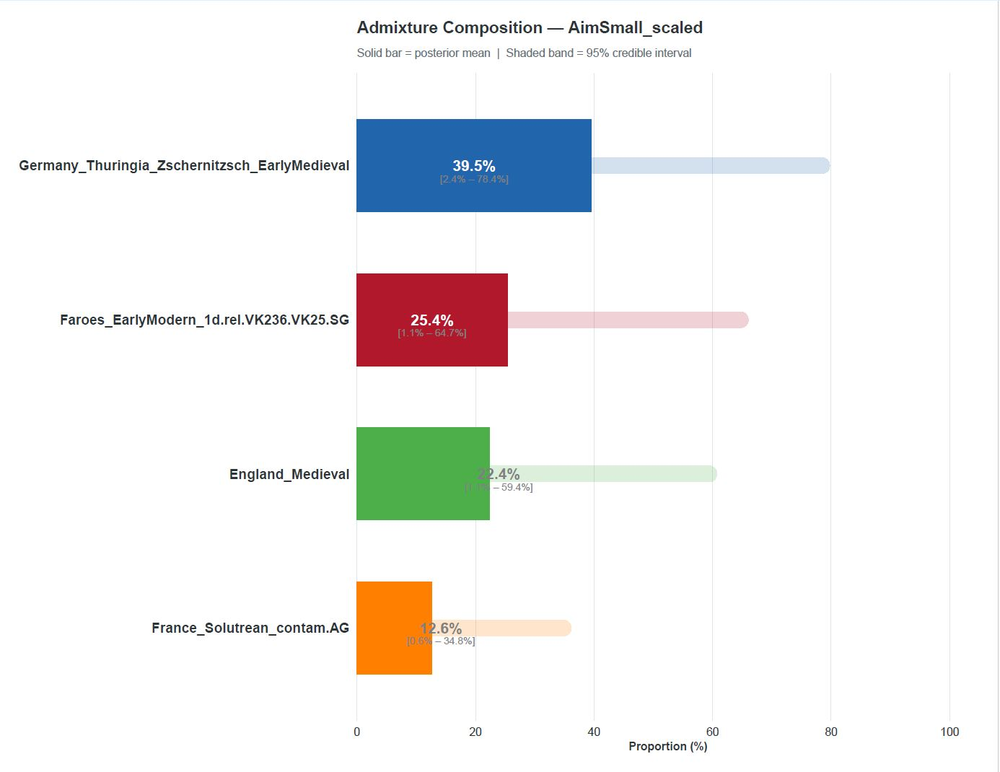
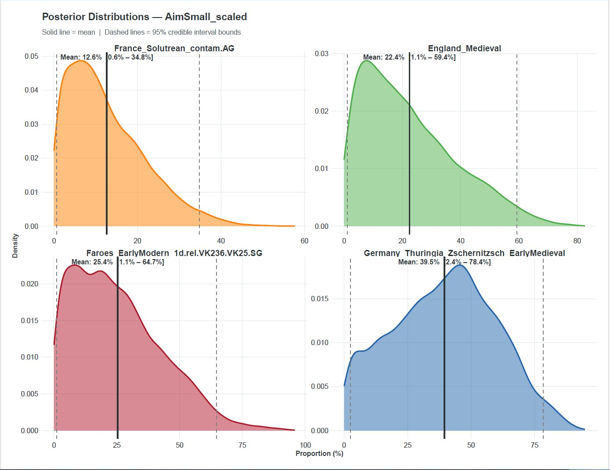
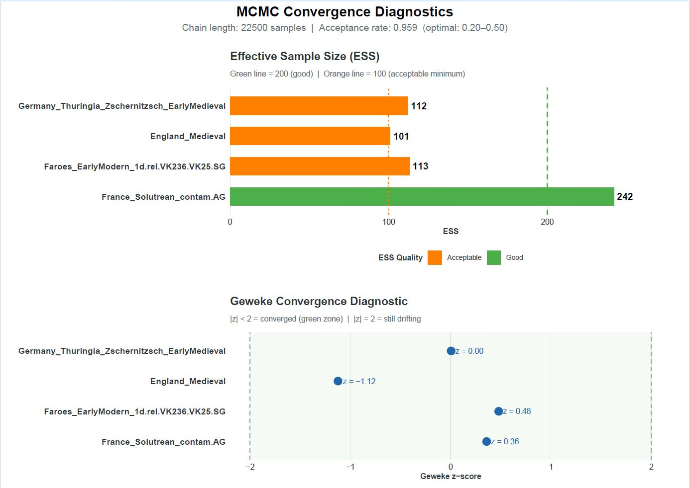

# G25 Bayesian MCMC Admixture Estimator

A Bayesian approach to ancestry decomposition from Global25 (G25) PCA coordinates, using Markov Chain Monte Carlo sampling to produce full posterior distributions over admixture proportions — not just point estimates.

**Now available in two versions:**

- **R Script** — command-line tool for batch processing, scripting, and integration into research pipelines
- **Web App** — browser-based interface with interactive charts, no installation required

Both versions implement the same statistical engine: multi-strategy pre-selection, forward stepwise BIC model selection, and Metropolis-Hastings MCMC with Dirichlet priors. They produce equivalent results — choose based on your workflow.

## The Problem with Current Tools

Tools like [Vahaduo](https://vahaduo.github.io/vahaduo/) are the standard front-end for working with G25 coordinates. They are fast, accessible, and have done an enormous amount to democratize population genetics for non-specialists. But under the hood, Vahaduo and similar calculators use **constrained least-squares optimization**: they find the weighted combination of source populations that minimizes the Euclidean distance to your target in 25-dimensional PCA space.

This approach has a fundamental limitation: **it gives you a single answer with no measure of confidence**.

When Vahaduo reports that you are "38% Yamnaya, 35% Anatolian Farmer, 22% Western Hunter-Gatherer, 5% CHG," every one of those numbers looks equally certain. But they aren't. The 38% Yamnaya might be rock-solid — the model cannot explain your coordinates without substantial Steppe ancestry. The 5% CHG, on the other hand, might be pure fitting noise — an artifact of the optimizer distributing residual error across available sources. Least-squares gives you no way to distinguish these two situations.

This is not a minor cosmetic issue. It leads to real misinterpretation. People compare results across runs, across calculators, across individuals, treating 2–3% differences as meaningful when they may be well within the noise floor of the method. Forum debates about whether someone has "real" Component X at 4% versus someone else at 6% are often debates about nothing.

## What This Tool Does Differently

This tool replaces the least-squares point estimate with **Bayesian inference via MCMC**, which treats each source population's contribution as a probability distribution rather than a fixed number.

The entire project was inspired by watching this video [The Algorithm That Made Modern AI Possible by StringsandTheory](https://www.youtube.com/watch?v=LDiklt4dV24).  After watching I wondered whether the techniques could be applied to admixture analysis.

### The Statistical Model

The target individual's G25 coordinates are modeled as a weighted sum of source population coordinates plus Gaussian noise:

```
target ≈ Σ_k  w_k · source_k  +  ε,      ε ~ N(0, σ²I)
```

The weights are given a **Dirichlet prior**, which naturally enforces the constraints that all proportions must be non-negative and sum to 1:

```
w ~ Dirichlet(α, α, ..., α)
```

The **Metropolis-Hastings algorithm** then explores the space of all possible weight combinations, sampling proportionally to the posterior probability. After discarding an initial burn-in period, the collected samples form an empirical approximation of the full posterior distribution over admixture proportions.

### What You Get

Instead of a single number per source, you get:

| Source | Mean | Median | 95% Credible Interval | Significant? |
|---|---|---|---|---|
| Yamnaya | 37.8% | 38.1% | [32.4% – 43.0%] | ✓ |
| Anatolian_EF | 34.6% | 34.5% | [29.1% – 40.3%] | ✓ |
| WHG | 22.1% | 22.0% | [17.8% – 26.9%] | ✓ |
| CHG | 5.5% | 4.9% | [0.0% – 12.8%] | ✗ |

*(Example output — not from real data)*

Now the 5.5% CHG component is immediately identifiable as uncertain: its credible interval includes zero, meaning the model can explain your coordinates perfectly well without it. The Yamnaya and WHG components, by contrast, have tight intervals that exclude zero — those are real signals.

## Why Bayesian MCMC Is an Improvement

### 1. Uncertainty Quantification

The most important advantage. Least-squares tells you *what*; Bayesian inference tells you *how sure*. A 95% credible interval of [32% – 43%] means something fundamentally different from [5% – 60%], but both would appear as a single number in Vahaduo.

### 2. Honest Treatment of Model Degeneracy

G25 has 25 dimensions, but many ancient populations cluster together in PCA space. Yamnaya and Corded Ware, for example, overlap substantially. When you ask a least-squares solver to split the difference between them, it makes an arbitrary choice. The Bayesian approach instead shows you the degeneracy directly: the posteriors for highly correlated sources will be wide, anti-correlated, and overlapping — a clear signal that the data cannot distinguish between them at the resolution available.

### 3. Principled Source Selection

The tool uses a multi-stage approach to decide which and how many source populations to include:

**Pre-selection** casts a wide net using four independent strategies run in parallel: a properly converged non-negative least-squares solver (coordinate descent, not the toy gradient descent used in naive implementations), greedy residual-chasing that iteratively finds sources explaining remaining residuals, Euclidean nearest-neighbor distance, and directional cosine similarity. Any source flagged by any method is kept as a candidate. This avoids the failure mode where a source is individually distant from the target but essential for the mixture — the classic example being Western Hunter-Gatherers in a modern European model.

**Forward stepwise selection** then builds up from K=1, at each step trying every remaining candidate and adding whichever one most improves the Bayesian Information Criterion (BIC). This balances fit quality against model complexity, naturally penalizing the inclusion of sources that don't meaningfully improve the reconstruction. The process stops when BIC increases for three consecutive additions.

### 4. Regularization via the Prior

The Dirichlet prior concentration parameter (`--alpha`) acts as a built-in regularizer. At `α = 1.0` (default), the prior is uniform — all possible weight combinations are equally likely *a priori*. Setting `α < 1.0` (e.g., 0.5) favors sparse solutions where most weights are near zero, naturally suppressing the small noise contributions that plague unconstrained least-squares. This is conceptually similar to LASSO regularization but arises naturally within the Bayesian framework rather than being bolted on as an ad hoc penalty.

### 5. Convergence Diagnostics

Both versions include built-in diagnostics so you can verify that the MCMC chain has actually converged and the results are trustworthy:

- **Effective Sample Size (ESS)**: How many independent samples the chain is actually providing after accounting for autocorrelation. Low ESS means the chain needs to run longer.
- **Geweke diagnostic**: A z-test comparing the mean of the first 10% of the chain to the last 50%. Values with |z| > 2 suggest the chain hasn't reached stationarity.
- **Trace plots**: Visual inspection of the chain's behavior over time. A well-mixed chain looks like white noise; a poorly-mixed chain shows trends, drift, or sticky patches.

---

## Choosing a Version

Both versions produce equivalent statistical results. The difference is in workflow and output format.

| Aspect | R Script | Web App |
|---|---|---|
| Installation | Requires R | None — open HTML in any browser |
| Interface | Command-line | Point-and-click with paste/upload |
| Input | CSV files on disk | Paste data or upload CSV |
| Output | CSV files + multi-page PDF | Inline tables and interactive charts |
| Batch processing | Yes (scripting, multiple targets) | One run at a time |
| Automation | Integrates into pipelines | Manual |
| Offline use | Yes | Yes (single HTML file, no server) |
| Best for | Researchers, batch runs, reproducible pipelines | Quick exploration, sharing results, no-install usage |

### Visual Comparison

The two versions present the same underlying data in different formats. Below are example outputs from each version using the same input data.

#### Web App

The web interface accepts pasted or uploaded G25 data and exposes all parameters as form controls. Results render inline with interactive charts.

**Input and run log:**



**Results — summary table, diagnostics cards, admixture bar chart, and posterior densities:**



**Results — trace plots, log-posterior trace, and convergence diagnostics table:**



#### R Script (PDF Output)

The R script outputs a multi-page PDF with publication-style plots.

**Admixture composition (bar chart with credible intervals):**



**Posterior distributions:**



**Convergence diagnostics (ESS bar chart and Geweke z-score plot):**



---

## R Script Version

### Installation

You need R plus three packages that the script uses for its PDF plots: `ggplot2`, `patchwork`, and `reshape2`. The script tries to install any that are missing the first time it runs, so on a machine with internet access you usually do not have to do anything. To install them yourself ahead of time:

```r
install.packages(c("ggplot2", "patchwork", "reshape2"))
```

The statistical engine (pre-selection, model selection, and MCMC) uses only base R. The three packages are needed only for the plotting step at the end, so if you strip out the plotting you can run the analysis on base R alone.

### Usage

#### Input Format

Standard G25 CSV format, compatible with Vahaduo and other G25 tools. No header row. The first column contains `Population:SampleName` labels (colon-delimited), followed by 25 numeric columns of PCA coordinates.

```
Yamnaya_Samara:I0357__BC_3021__Cov_66.29%,0.132,0.175,...
Yamnaya_Samara:I0429__BC_2888__Cov_43.01%,0.129,0.171,...
Anatolia_EF:I0736__BC_6419__Cov_52.11%,0.054,0.021,...
WHG:Loschbour__BC_6100__Cov_99.10%,0.081,-0.063,...
```

You need two files: a **source file** containing the reference populations, and a **target file** containing the individual(s) you want to model.

#### Basic Usage

```bash
Rscript g25_bayesian_mcmc.R \
  --source references.csv \
  --target myself.csv \
  --mode population \
  --out my_results
```

#### Full Options

```
Required:
  --source   CSV of source/reference G25 coordinates
  --target   CSV of target individual(s) G25 coordinates

Options:
  --mode     'population' (average per pop) or 'sample'    [default: population]
  --out      Output file prefix                            [default: results]
  --iter     Total MCMC iterations                         [default: 50000]
  --burnin   Burn-in iterations to discard                 [default: 10000]
  --thin     Thinning interval                             [default: 10]
  --max_k    Max source components (0 = auto via BIC)      [default: 0]
  --n_keep   Pre-selection candidates to keep              [default: 25]
  --sigma    Noise std dev in likelihood (used when --sigma_mode fixed) [default: 0.01]
  --sigma_mode  'empirical' (derive from panel), 'fixed' (--sigma), or 'bayes' (sample sigma) [default: empirical]
  --hetero   Per-dimension noise, TRUE/FALSE                [default: FALSE]
  --sigma_prior_strength  bayes prior pseudo-count, 0 = #dims [default: 0]
  --alpha    Dirichlet prior concentration                 [default: 1.0]
  --conc     MCMC proposal concentration (step size)       [default: 30]
  --seed     Random seed                                   [default: 42]
```

#### Population vs. Sample Mode

Like Vahaduo's aggregation toggle:

- `--mode population` averages all samples within each population before fitting. Use this when your references contain many samples per population and you want to model against population centroids.
- `--mode sample` treats each sample as an independent source. Use this when you want finer granularity or when populations contain only one sample each.

#### Output Files

For each target individual, the script produces:

| File | Contents |
|---|---|
| `<out>_summary.csv` | Point estimates (mean, median) + 95% credible intervals for each source |
| `<out>_posterior.csv` | Full posterior samples (post burn-in and thinning) for downstream analysis |
| `<out>_diagnostics.txt` | ESS and Geweke convergence diagnostics |
| `<out>_plots.pdf` | Posterior density plots, forest plot with CIs, trace plots |

If multiple targets are provided, each gets its own set of output files (`_target1_`, `_target2_`, etc.) plus a combined summary CSV.

---

## Web App Version

### Getting Started

1. Open `g25_bayesian_mcmc.html` in any modern browser (Chrome, Firefox, Safari, Edge).
2. Paste your G25 source data into the left panel (or upload a CSV file).
3. Paste your target data into the right panel (or upload a CSV file).
4. Adjust parameters if desired (defaults match the R script).
5. Click **Run MCMC**.

The input format is identical to the R script — standard G25 CSV with `Population:SampleName` in the first column followed by 25 coordinate values. Both comma-separated and tab-separated formats are supported.

### What You See

Results render inline below the run log:

- **Summary table** with mean, median, SD, 95% credible intervals, and significance flags for each source
- **Diagnostics cards** showing fit RMSE, acceptance rate, chain length, and number of sources selected
- **Admixture composition bar chart** with solid bars for posterior means and faded bars for 95% credible intervals
- **Posterior density plots** with kernel density estimation, mean lines, and CI boundaries
- **Component trace plots** for visual convergence assessment
- **Log-posterior trace** with burn-in boundary marker
- **Convergence diagnostics table** with ESS and Geweke z-scores

### Technical Notes

The web version runs entirely client-side — no data is sent to any server. The entire MCMC engine, NNLS solver, pre-selection pipeline, and visualization code are contained in a single HTML file. This means:

- **Privacy**: Your genetic data never leaves your browser.
- **Offline use**: Save the HTML file locally and it works without an internet connection (fonts will fall back to system defaults).
- **Performance**: For large iteration counts (100k+), the browser's main thread may block briefly during MCMC sampling. For very heavy runs, the R script version is recommended.

### Parameters

All parameters from the R script are exposed as form controls in the web interface. Hover labels match the command-line flag names. Defaults are identical between versions.

---

## Recent Fixes: Sampler Correctness

An earlier release of both the R script and the web app had a bug in the part of the MCMC sampler that tunes its own step size. The effect was consistent and one-directional: the credible intervals came out too narrow, so every component looked more certain than the data actually supports. This release corrects it. If you ran an older version, it is worth re-running your analyses, because the point estimates will move only a little but the interval widths will change noticeably.

Here is what changed, and what each change means in practice.

### The step-size tuning ran in the wrong direction

On each step the sampler proposes a new set of proportions and then either accepts or rejects it. The acceptance rate is the fraction it accepts, and it tells you whether the steps are sized well. A very high rate means the steps are tiny and the chain is barely moving. A very low rate means the steps overshoot and almost nothing gets accepted. The healthy range is roughly 20 to 50 percent.

The old code adjusted the step size the wrong way, so instead of settling into that range the acceptance rate drifted up toward 100 percent and stayed there. A chain that accepts nearly everything has effectively stopped moving. It still reports narrow intervals, but they are narrow only because the chain never visited the alternatives, so they understate the real uncertainty. The tuning now moves in the correct direction, and it responds to the acceptance rate over the most recent block of iterations instead of a running average from the start of the run, so it finds a good step size quickly.

### The starting step size was too small, and is now adjustable

The proposal began very tight, which is what let the acceptance rate run away in the first place. It now starts at a more reasonable value. It is also exposed as a parameter you can set: `--conc` in the R script and the "Proposal conc." field in the web app. Most runs will never need to touch it, but it is there if a particular dataset wants larger or smaller steps.

### The acceptance test used a slightly wrong proposal density (R script)

The formula that decides whether to accept a step, the Metropolis-Hastings ratio, has to be computed from the exact proposal distribution the sampler drew from. In the R script it was computed from a slightly different one whenever a component's weight pressed against a small internal floor. That broke the balance condition MCMC relies on to sample the right distribution, and it biased results when a component was near zero. The R script now uses the exact proposal in the ratio. The web app already handled this correctly, so this particular fix applies only to the R version.

### Near-identical sources now produce a warning

If two of the selected source populations sit almost on top of each other in G25 space, no method can decide how to divide ancestry between them. Any split that keeps their sum fixed fits the target equally well, so the individual percentages are arbitrary even though their combined share may be well determined. The tool now checks the final source set and prints a warning that names the offending pair. It measures the distance between the two sources against the noise level (`sigma`); when that distance is small enough that the split could sit almost anywhere between 0 and 100 percent, it flags the pair. When you see this warning, read the two flagged percentages as one combined number rather than two separate signals.

### A numerical edge case in the proposal

When a component's weight became very small, the underlying random draw could round down to exactly zero, which forced that step to be thrown out. The draw is now kept just above zero. This mostly matters if you run with a sparse prior (`--alpha` below 1), where small weights are common.

### How to tell a run is healthy

After any run, check two numbers:

- **Acceptance rate**: you want it roughly between 0.2 and 0.5. The web app shows this in green when it is in range. If it is close to 1.0, the run is not to be trusted.
- **Effective sample size (ESS)**: you want at least about 200 per active component. If it is lower, raise the iteration count and run again.

When both look right, the credible intervals are dependable. If the intervals are wider than an older version gave you, that is expected and correct. The old ones were understating the uncertainty, which is the exact mistake this whole tool exists to avoid.

### New Capabilities: Data-Derived Noise (Phases 1 to 3)

Alongside the correctness fixes above, three features were added that all attack the same weak point: the noise level (sigma) used to be a number you had to guess, and that guess silently decided both how many sources you got and how wide your intervals came out. These features let the data set that number instead. Each is covered in full in the Tuning Guide; this is the short version of what changed and why it helps.

**Phase 1, the empirical noise floor.** The tool now measures the noise directly from your source panel. When a population has several samples, the scatter of those samples around their own mean is a direct measurement of per-individual noise in G25 space, and pooling it across every multi-sample population gives a measured floor. This is now the default (`--sigma_mode empirical`). In practice it means the old question "is this minor component real or am I overfitting?" answers itself: the component either survives at your data's measured noise level or it does not. On a typical Ancients panel the measured floor lands near 0.010, which happens to confirm that the old hardcoded default was reasonable, but now the tool reports it rather than assuming it.

**Phase 2, sampling sigma (`--sigma_mode bayes`).** Instead of fixing the noise at the measured floor, this treats it as another unknown and samples it during the MCMC, anchored to the floor by an informative prior so it cannot run away and fabricate components. The payoff is a direct read on whether your sources are adequate: if the sampled sigma stays at the floor they are, and if it drifts upward there is ancestry the panel is not capturing. Your weight intervals also widen a little to reflect that you never knew the noise exactly, which is the honest thing to report.

**Phase 3, per-dimension noise (`--hetero`).** The 25 G25 dimensions do not carry equal signal, so a single noise number is a simplification. This measures a separate level for each dimension and weights them accordingly, so noisier axes count for less. It composes with any sigma mode and only changes results when the dimensions genuinely differ.

Two supporting changes came with these. Pre-selection's slowest step now searches a shortlist rather than the whole panel, cutting it from about a minute to a few seconds on a large file, and the effective-sample-size calculation was switched to an FFT so diagnostics stay fast on long chains. The tool also prints progress through the previously silent stretches. A near-identical-source warning, added with the correctness work, rounds this out: when two selected sources sit too close to be told apart, it names them so you know the split between them is arbitrary even when their combined share is solid.

Both the R script and the web version now carry all of the above.

## Tuning Guide

These recommendations apply to both versions.

### Sigma (σ) — Likelihood Noise

This controls how tightly the model demands the weighted combination match your target coordinates.

- `0.01` (default): Good general-purpose setting. Tolerates the level of noise typical in G25 coordinates from well-covered ancient samples.
- `0.005`: Tighter fit. Use for high-coverage modern samples where you trust the coordinates are precise.
- `0.02–0.03`: Looser fit. Use for low-coverage ancient samples where coordinates may be noisy, or when you want broader credible intervals that better reflect true uncertainty.

### Alpha (α) — Dirichlet Concentration

Controls the prior preference for sparse vs. distributed solutions.

- `1.0` (default): Uniform prior. All possible weight combinations are equally likely *a priori*. Lets the data speak entirely for itself.
- `0.5`: Mildly sparse. Encourages the model to push small, uncertain components toward zero. Good when you suspect overfitting.
- `0.1`: Strongly sparse. Aggressively favors solutions with few dominant components. Use with caution — can suppress real minor ancestry.
- `2.0+`: Anti-sparse. Favors solutions where weight is distributed more evenly. Rarely useful for admixture modeling.

### n_keep — Pre-Selection Pool Size

How many candidate sources survive the pre-selection filter before forward stepwise selection.

- `25` (default): Good for reference sets up to ~5,000 populations.
- `40–50`: Recommended for very large reference sets (10,000+ populations) or when you want to be extra cautious about missing relevant sources.
- The forward stepwise selection will prune the extras, so erring on the high side costs computation time but not accuracy.

### Iteration Count

- `50,000` (default): Usually sufficient for well-separated sources with K ≤ 8.
- `100,000–200,000`: Recommended if diagnostics show low ESS or failed Geweke tests.
- Check the diagnostics — if ESS < 200 for any active component, increase iterations.

### Estimating Sigma Automatically (`--sigma_mode`)

Sigma is the assumed per-dimension noise between your target and the best mixture of sources. It controls two things at once: how many sources survive selection, and how wide the credible intervals come out. Picking it by hand means guessing your data's precision, and guessing too low invents components that are really noise while guessing too high hides real ones.

Both versions can now derive sigma from your source file instead. When a source population has several samples, the scatter of those samples around their population mean measures the real per-individual noise in G25 space. Pooling that scatter across every multi-sample population gives a measured noise floor, which the tool then propagates into a per-target sigma using the sample counts behind the target and the selected sources.

- `empirical` (default): derive sigma from the panel as described above. The run prints the recovered noise floor and the per-target sigma it used. If your panel has too few multi-sample populations to estimate from, it automatically falls back to `fixed`.
- `fixed`: use the `--sigma` value directly, reproducing the tool's earlier behavior. Use this if you want to set the noise level yourself, or to reproduce an older analysis exactly.
- `bayes`: start from the same empirical floor, but treat sigma as another unknown and sample it during the MCMC instead of holding it fixed. This propagates the uncertainty in sigma into the weight intervals, so they widen slightly to reflect that you did not know the noise level exactly. Selection still uses the fixed floor, so the number of sources does not change; only the final inference does. The run reports a posterior for sigma (mean and 95 percent interval) alongside the weights.

Empirical mode removes the guesswork behind questions like "is this third component real or am I overfitting." The component either survives at your data's measured noise floor or it does not. Bayes mode goes one step further by not pretending the floor is exact.

A note on how bayes stays safe. Left unconstrained, estimating sigma from a single target's 25 residuals could let it shrink toward the fit and manufacture false components, the exact failure mode that too-small a fixed sigma produces. To prevent that, bayes anchors sigma to the panel floor with an informative prior whose strength you can set with `--sigma_prior_strength` (a pseudo-count; the default, 0, uses the number of dimensions). Because the floor is measured from thousands of within-population degrees of freedom, sigma stays near it and can only drift upward if this particular target genuinely misfits the sources. Raising the pseudo-count anchors it harder; lowering it lets the target's own residuals speak more.

#### Which mode should I pick?

Most of the time, leave it on `empirical`. Here is the fuller guidance, in order of how often you will want each.

**`empirical` is the right choice for almost everything.** It measures the noise floor from your own panel instead of making you guess, so you get calibrated intervals with no extra thought. If you only touch this setting once, leave it here.

**`bayes` is worth reaching for when the fit quality itself is the question.** It does everything empirical does, then samples the noise level too, which answers something empirical cannot: are my sources actually good enough to explain this target? If the posterior sigma settles near the floor, your sources are adequate; if it drifts upward, the model is telling you there is ancestry the panel is not capturing. The cost is slightly wider intervals, which is honest rather than a defect, and a little more runtime. Use it for final, careful analyses, or whenever you are second-guessing your source panel.

**`fixed` is for reproducing old runs or deliberately overriding the noise level.** Pick it only when you have a specific reason to set sigma by hand: matching an earlier analysis exactly, or testing how a result behaves at a noise level you choose. It is the one mode where a poor choice quietly hurts you, since too-small a fixed sigma manufactures false components, so do not use it casually.

Rule of thumb: empirical for everyday work, bayes for final results or when you suspect your sources are inadequate, fixed only when you specifically need manual control. The `--hetero` toggle is a separate axis and composes with any of the three; leave it off unless you have reason to think the G25 dimensions carry genuinely different noise. Whichever mode you choose, the near-duplicate warning and the acceptance-rate and ESS checks behave the same, so your test for a trustworthy run does not change.

### Per-Dimension Noise (`--hetero`)

By default the tool uses one sigma for all 25 G25 dimensions. In reality the dimensions carry very unequal variance, so a single number is a simplification. Passing `--hetero TRUE` estimates a separate noise level for each dimension from the same within-population scatter, and weights each dimension in the likelihood and in model selection by how noisy it actually is. This keeps the high-variance early dimensions from drowning out the low-variance later ones. It composes with any `--sigma_mode`; with `bayes`, a single overall scale is sampled on top of the per-dimension shape. On data where the dimensions really do share a noise level, per-dimension and scalar give the same answer, so the flag only changes results when the heteroscedasticity is real.

### Performance and progress

Two changes make large runs faster and less opaque. Pre-selection's residual-chase step now searches only the pool of candidates the cheaper methods already flagged rather than the entire panel, which cuts it from about a minute to a few seconds on a 5000-source file without dropping essential sources (they always carry non-zero NNLS weight and so stay in the pool). Convergence diagnostics now compute autocorrelations by FFT rather than a lag-by-lag loop, so effective sample size on a long chain drops from several seconds to a fraction of one and no longer trails the run. The script also prints a heartbeat through the previously silent stretches: the noise-floor scan, each residual-chase round, the MCMC iterations, and the diagnostics step.

The web app picked up two further fixes on the same front. Its NNLS solver used to build the full K×K source-similarity matrix before solving anything — fine at a few hundred sources, but a 20,000-source panel means a 3+ GB matrix and a solve that scales quadratically with panel size. It now solves the same problem without ever building that matrix, so cost scales with K·D instead of K². Separately, the MCMC sampler was allocating several small arrays every iteration, which adds up fast over hundreds of thousands of iterations; it now reuses preallocated buffers instead. On a real 5,270-population, 20,118-sample panel at 500,000 iterations, a run that took 1 minute 45 seconds before both fixes now finishes in about 13–14 seconds. Output was checked against the original implementation on identical seeds and matches to the last bit — this was a speed change, not a behavior change.

### Proposal Concentration (`--conc`) — MCMC Step Size

This sets how big a step the sampler tries on each iteration. It is a tuning knob for the sampler, not a modeling choice, so it changes how efficiently the chain explores but not the model itself. Higher values mean smaller, more cautious steps; lower values mean larger, bolder steps.

- `30` (default): A good starting point. The sampler adjusts it automatically during burn-in, so for most runs you can leave it alone.
- Raise it (for example `100`) if the acceptance rate is coming out too low (well under 0.2), which means the steps are overshooting.
- Lower it (for example `10`) if the acceptance rate is coming out too high (well over 0.5), which means the steps are too timid.

Because the automatic tuning already pushes the acceptance rate toward the healthy 0.2 to 0.5 range, changing this by hand is rarely necessary. It is most useful for very high-dimensional runs or difficult targets where the automatic tuning needs a better starting point.

## Limitations and Caveats

**PCA is lossy.** G25 coordinates are a 25-dimensional compression of hundreds of thousands of SNPs. No statistical method operating on PCA-reduced data can recover information lost during dimensionality reduction. Formal methods like qpAdm that work on f-statistics computed from full genotype data are more rigorous for published research — but also far less accessible.

**This is not a replacement for formal admixture analysis.** It is a more statistically principled replacement for the least-squares fitting that tools like Vahaduo perform on PCA coordinates. The underlying data (G25 coordinates) and the fundamental modeling assumption (target = weighted sum of sources) are the same.

**Computational cost scales with reference set size.** The pre-selection step involves solving NNLS against all sources; in the web app this now scales with K·D rather than K², so a 5,000-population panel finishes pre-selection in a few seconds instead of minutes. The MCMC step itself is fast since it operates on the reduced candidate set. Very large panels (tens of thousands of sources) will still take proportionally longer, just linearly rather than quadratically.

**The model assumes the "true" sources are in your reference set.** If your actual ancestry includes a population not represented in the references, the model will approximate it as a mixture of whatever is available — just like Vahaduo does. The credible intervals will be wider in this case, which is at least more honest than a confident wrong answer.

## How It Compares to Vahaduo

| Aspect | Vahaduo | This Tool |
|---|---|---|
| Method | Constrained least-squares | Bayesian MCMC (Metropolis-Hastings) |
| Output | Single point estimate per source | Full posterior distribution + credible intervals |
| Uncertainty | None reported | 95% credible intervals + significance flags |
| Source selection | User-specified | Automatic via multi-strategy pre-selection + forward stepwise BIC |
| Regularization | None | Dirichlet prior (adjustable sparsity) |
| Convergence verification | N/A | ESS, Geweke diagnostic, trace plots |
| Speed | Instant | Seconds to minutes (depending on iterations and reference set size) |
| Dependencies | Web browser | Base R (script) or web browser (web app) |
| Ease of use | Very easy (GUI) | GUI (web) or command-line (R) |

## Relationship to Other Methods

**ADMIXTURE** (Alexander et al., 2009) uses a similar probabilistic framework but operates on raw genotype data, not PCA coordinates. It estimates both the ancestral allele frequencies and the admixture proportions simultaneously using an EM algorithm. This tool is closer in scope to what Vahaduo does — operating on pre-computed PCA coordinates — but with a more principled statistical framework.

**qpAdm** (Haak et al., 2015) tests specific admixture models using f-statistics and is considered the gold standard for formal admixture testing in population genetics. It operates on entirely different mathematical foundations (f4 statistics rather than PCA distances) and provides p-values for model fit. This tool is not a substitute for qpAdm.

**ChromoPainter/fineSTRUCTURE** (Lawson et al., 2012) uses chromosome painting and MCMC to infer fine-scale population structure from haplotype data. It is far more data-intensive and methodologically distinct from PCA-based approaches.

This tool occupies a specific niche: bringing Bayesian uncertainty quantification to the PCA-coordinate-based admixture fitting that the ancient DNA hobbyist community already uses daily.

## Repository Structure

```
├── g25_bayesian_mcmc.R          # R script (command-line version)
├── g25_bayesian_mcmc.html       # Web app (browser version, single file)
├── README.md
├── screenshots/
│   ├── G25_Bayesian_input.JPG   # Web app: input interface
│   ├── G25_Bayesian_results.JPG # Web app: results (table, charts, densities)
│   ├── G25_Bayesian_results2.JPG# Web app: results (traces, diagnostics)
│   ├── k8_comp.JPG              # R script: admixture composition PDF
│   ├── k8_posterior.JPG         # R script: posterior distributions PDF
│   └── k8_conv.JPG              # R script: convergence diagnostics PDF
```

## License

This project is licensed under the GNU General Public License v3.0 - see the [LICENSE](LICENSE) file for details.

## Contributing

Issues and pull requests are welcome. Particular areas where contributions would be valuable:

- Performance optimization for very large reference sets (10,000+ populations)
- Web Worker threading for the web version to prevent UI blocking during long MCMC runs
- Multiple independent chains with Gelman-Rubin (R-hat) convergence diagnostics
- Hierarchical priors that encode known phylogenetic relationships between source populations
- Variational inference as a fast approximate alternative to full MCMC
- Export functionality in the web version (CSV download of posterior samples)
